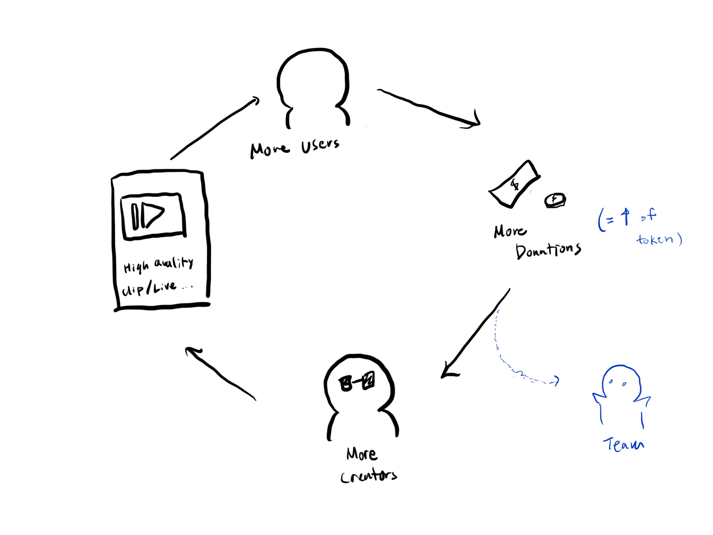

# Donation-block
Version: 1.0
 Date: 2019.02.19

## Current Problem
* Unable to see donations are well delivered to Creators.
* Current platforms are taking some portion (about 30%) of viewers' donation as commision.
   (ex. twitch, youtube, etc...)

## Solution
* Use block chain to show donations are well delivered.
* Lower commisions, more delivered to creators.

## Token Economy

